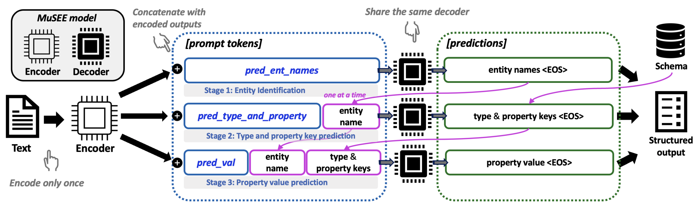
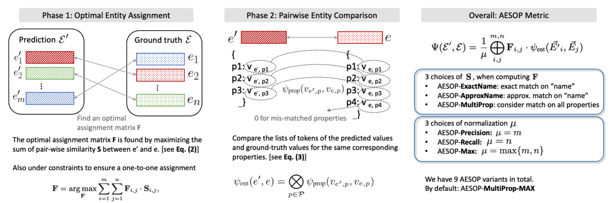

# Learning to Extract Structured Entities Using Language Models

<p align="left">
    <a href="https://opensource.org/licenses/MIT">
        
    </a>
</p>


⚙️ This is the implementation of our collaboration between **MSR** and **Mila**, ["**Learning to Extract Structured Entities Using Language Models**"](https://arxiv.org/pdf/2402.04437), accepted to **EMNLP 2024 Main conference**. **[🔥 Oral, top 7% of all accepted papers 🔥]**

## Abstract
Recent advances in machine learning have significantly impacted the field of information extraction, with Language Models (LMs) playing a pivotal role in extracting structured information from unstructured text. Prior works typically represent information extraction as triplet-centric and use classical metrics such as precision and recall for evaluation. We reformulate the task to be entity-centric, enabling the use of diverse metrics that can provide more insights from various perspectives. We contribute to the field by introducing Structured Entity Extraction and proposing the Approximate Entity Set OverlaP (AESOP) metric, designed to appropriately assess model performance. Later, we introduce a new Multi-stage Structured Entity Extraction (MuSEE) model that harnesses the power of LMs for enhanced effectiveness and efficiency by decomposing the extraction task into multiple stages. Quantitative and human side-by-side evaluations confirm that our model outperforms baselines, offering promising directions for future advancements in structured entity extraction.




## Install Dependencies
```bash
conda create -n MuSEE python=3.8 --file requirements.txt
conda activate MuSEE
```

## Directory structure
```
data/  # Dataset generation code will be released soon due to internal process to go through.
|-- GPT4-based/  # GPT4-based dataset
|-- Wikidata-based/  # Wikidata-based dataset
|-- nyt/  # New York Times Relation Extraction dataset
|-- conll04/  # CoNLL04 dataset
|-- REBEL/  # REBEL dataset
|-- TREX/  # T-REx dataset
|-- dataloader_musee.py  # Dataloader for MuSEE model
model/
|-- t5_with_t5decoder.py  # base model architecture for MuSEE
trainer/
|-- trainer_musee.py  # Trainer for MuSEE model
args.py  # Arguments for MuSEE model and running experiments
experiment_musee.py  # Main file to run experiments
metric.py  # Calculate different variants of the proposed AESOP metric
compute_metrics.py  # Calculate metrics for the entire dataset
requirements.txt  # Required packages
utils.py  # Utility functions
```

## Run the code
```
python experiment_musee.py \
    --model_choice=musee \
    --dataset=gpt4 \
    --pretrained_model_name=t5-large \
    --batch_size=1 \
    --epochs=100 \
    --log_wandb=True \
    --use_lora=True \
    --lr=1e-4 \
    --weight_decay=1e-2 \
    --mode=train \
    --loss_mode=mean \
    --use_better_init=True
```

## Citation and Contact
If you find this paper useful, please cite our work:
```
@inproceedings{wu2024structured,
    title={Structured Entity Extraction Using Large Language Models},
    author={Haolun Wu, Ye Yuan, Liana Mikaelyan, Alexander Meulemans, Xue Liu, James Hensman, and Bhaskar Mitra},
    booktitle = "Proceedings of the 2024 Conference on Empirical Methods in Natural Language Processing",
    month = nov,
    year = "2024",
    address = "Miami, USA",
    publisher = "Association for Computational Linguistics",
}
```

💬 If you have any questions, feel free to contact us through email (haolun.wu@mail.mcgill.ca, ye.yuan3@mail.mcgill.ca) or Github issues. Enjoy!


